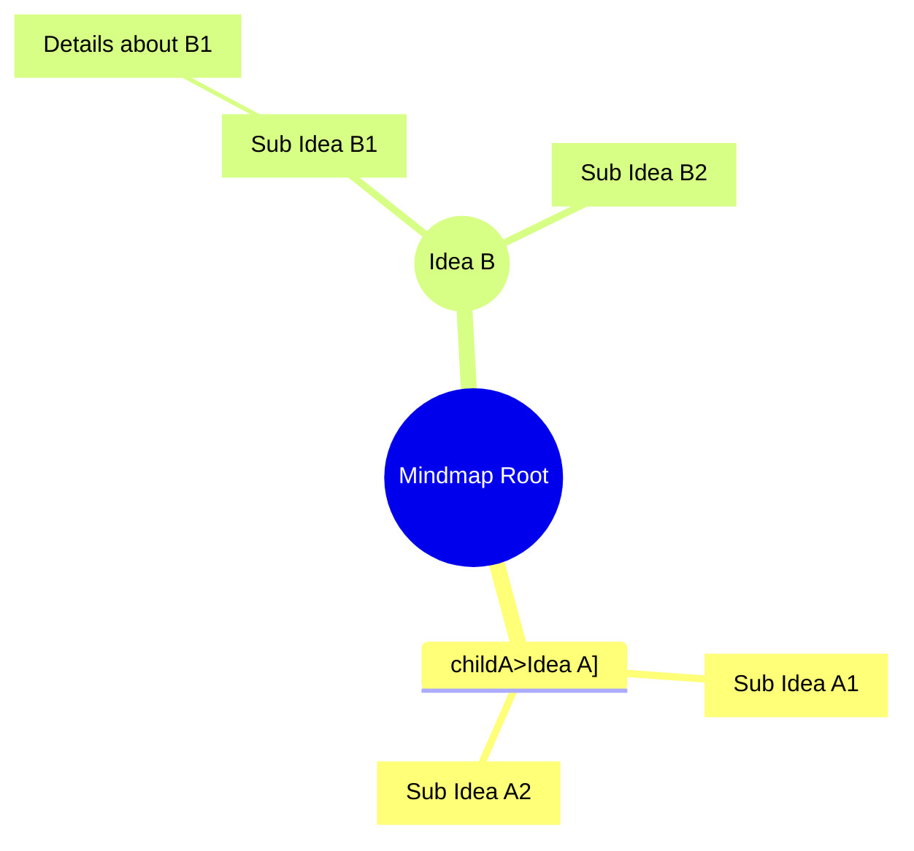

--8<-- "README.md"
Ping 4.

```mermaid
mindmap
  root((Mindmap Root))
    childA>Idea A]
      subchildA1[Sub Idea A1]
      subchildA2[Sub Idea A2]
    childB((Idea B))
      subchildB1[Sub Idea B1]
        subsubchildB1[Details about B1]
      subchildB2[Sub Idea B2]
```
